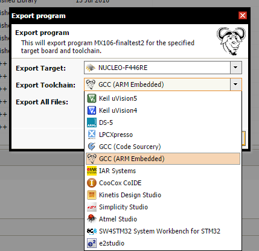

# MBED

##Setup the development environment

###Windows

####Install the software packages

1. Download the [Eclipse CDT](https://eclipse.org/cdt/downloads.php)
	This version is standard eclipse with additional packages suitable for C/C++ development
    Please select the 32 or 64 version depending on your computer and **java installation**.
2. Install the [gcc-arm-none-eabi](https://launchpad.net/gcc-arm-embedded/+download)
	This is a modified version of the **GCC** compiler that targets ARM processors. We will 
    setup eclipse in order to use this version. It is often updated and it tracks the original GCC branch
    Currently only the 32bit version is available.

####Open a Makefile project

After having download an mbed project from the online compiler (see [Export online compiler project](mbed.md#Export_online_compiler_project) or having cloned a git project (see [git](git.md) ) 

##Export online compiler project

It is possible to export an online project and open it in eclipse. 
Go to the online compiler, click with the right mouse button on the project directory, select export -> GCC compiler, or, from the project page, click on **export to desktop IDE** 

NOTE: Make sure to select the **Also include repositories and other files** checkbox
